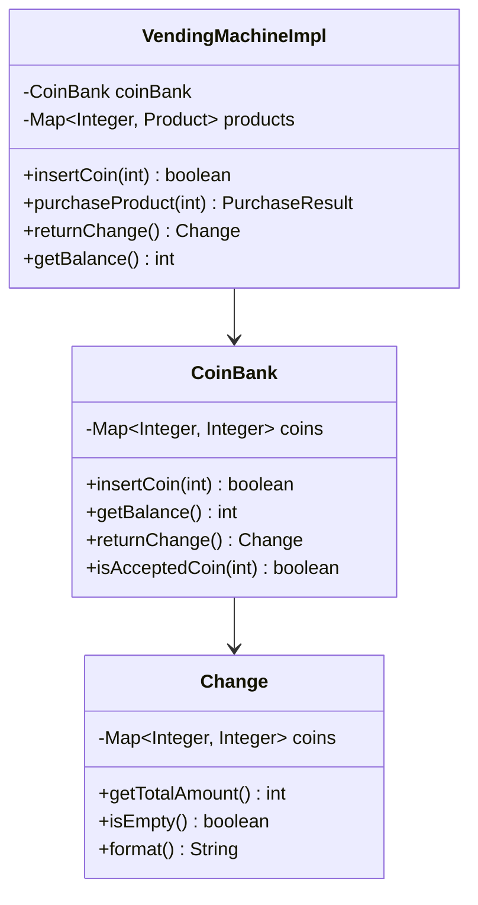

## Part 2 — Optional Challenge

Extend your design with one meaningful improvement. Write a short explanation of:

- What you added
- Why it makes the system better
- What OOP concept it demonstrates

---

CoinBank owns accepted coin validation and balance tracking, and VendingMachineImpl.getBalance() delegates to coinBank.getBalance(). 
This makes the optional challenge a real design improvement, not just extra printing.
