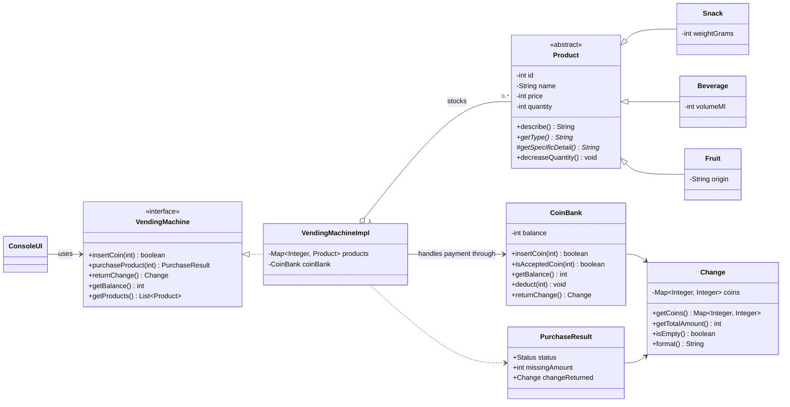
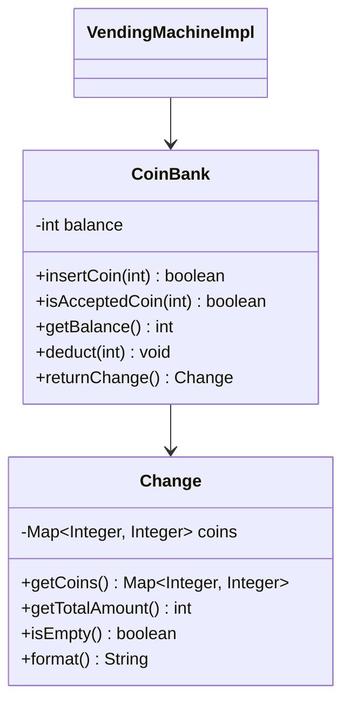

# Vending Machine OOP Workshop

Java console application for the Lexicon OOP vending machine workshop.

The project models a vending machine that stocks snacks, beverages, and fruit. Products share common state through an abstract `Product` base class, while each concrete product type provides its own display detail through polymorphism.

## Features

- Product hierarchy with `Snack`, `Beverage`, and `Fruit`
- Encapsulated product fields with constructor validation
- Vending machine logic separated from console UI
- Swedish coin validation for `1`, `2`, `5`, `10`, `20`, and `50` kr
- Purchase handling for success, unknown product, insufficient balance, and out of stock
- Automatic change return after a successful purchase
- JUnit tests for vending machine business rules
- Runnable JAR configuration through Maven
- Integrated optional challenge: `CoinBank` and `Change` handle payment and coin breakdowns

## Project Structure

```text
src/main/java/se/lexicon
|-- Main.java
|-- machine
|   |-- PurchaseResult.java
|   |-- VendingMachine.java
|   `-- VendingMachineImpl.java
|-- model
|   |-- Beverage.java
|   |-- Fruit.java
|   |-- Product.java
|   `-- Snack.java
|-- payment
|   |-- Change.java
|   `-- CoinBank.java
`-- ui
    `-- ConsoleUI.java

src/test/java/se/lexicon
|-- machine
|   `-- VendingMachineImplTest.java
`-- payment
    `-- CoinBankTest.java
```

## Core Design



## Optional Challenge: Coin Bank

The optional challenge adds a small payment model in `se.lexicon.payment`, and it is now wired into the vending machine.

`CoinBank` is responsible for accepted coin validation, balance tracking, deducting a purchase amount, and returning the remaining balance as a `Change` object. `Change` stores an immutable coin breakdown and can format it for display.

`VendingMachineImpl` no longer owns its own `balance` or accepted coin list. Instead, it composes a `CoinBank` and delegates payment behavior to it. This avoids having the old and new payment designs side by side.



This demonstrates composition and encapsulation: payment behavior has moved out of the vending machine class and into a focused collaborator.

## Run Tests

```powershell
mvn test
```

## Build Runnable JAR

```powershell
mvn clean package
```

Run the application:

```powershell
java -jar target/OOP_Workshop_VendingMachine-1.0-SNAPSHOT.jar
```

## Notes

The project currently targets Java 21 in `pom.xml`, which is a long-term support Java version.
